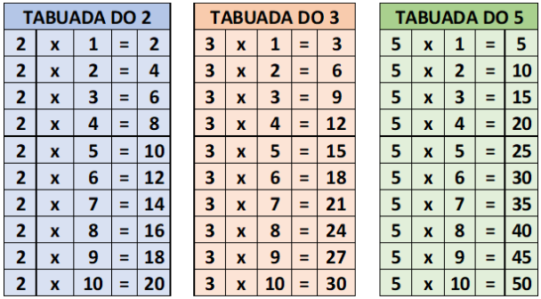

# Exercício 7

## Descrição:

*Um aluno do ensino fundamental precisa fazer como tarefa de casa a tabuada de alguns números inteiros, como nos exemplos em anexo.
Para ajudar esse aluno, você deve elaborar um algoritmo que solicite que seja digitado um número inteiro e que no final imprima o resultado da tabuada desse número.*



*Para ajudar esse aluno, você deve elaborar um algoritmo que solicite que seja digitado um número inteiro e que no final imprima o resultado da tabuada desse número.*

## Resposta:

```var
numero, contador: inteiro
inicio
escreva(“Digite o número que deseja verificar a tabuada:”)
leia(numero)
para contador de 0 até 10 faca
escreva(numero, “X”, contador, “=”, numero * contador)
fimpara
```

